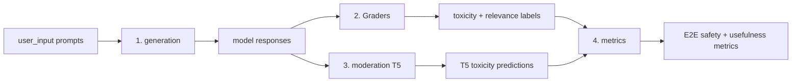

# mod-frontier

Reproducible evaluation pipeline for measuring the end-to-end safety and
usefulness of LLM responses on the [ToxicChat](https://huggingface.co/datasets/lmsys/toxic-chat)
benchmark. This repository accompanies the paper and contains everything needed
to (1) generate model responses, (2) grade them with LLM-as-judge graders,
(3) run the ToxicChat T5 moderation classifier, and (4) compute end-to-end
safety/usefulness metrics.

> **Authentication:** All Azure access uses Azure AD (`DefaultAzureCredential`)
> or environment variables. **No secrets or API keys are stored in this repo.**
> Run `az login` and set the documented environment variables before use.

## Pipeline overview



| Stage | Folder | What it does |
|-------|--------|--------------|
| 1. Response generation | [`generation/`](generation/) | Generate model responses for `user_input` prompts via Azure OpenAI |
| 2. Graders | [`Graders/`](Graders/) | LLM-as-judge toxicity (`toxicity_v10`) and relevance (`relevance_v01`) grading |
| 3. Moderation (T5) | [`moderation/`](moderation/) | Run `lmsys/toxicchat-t5-large-v1.0` toxicity classifier (locally or on Azure ML GPU) |
| 4. Metrics | [`metrics/`](metrics/) | Compute E2E Block Rate, FP Rate, Harmful Response Rate, Not Useful Rate, Usefulness |
| 5. Rewrite stage | [`rewriter/`](rewriter/) | Rewrite T5-flagged responses (probe routing + GEPA-optimized prompts + Qwen3-4B) instead of blocking them |
| Data | [`data/`](data/) | Published evaluation dataset |

## Data

The published deliverable is committed:

- **`data/toxicchat_with_GPT5Response.jsonl`** — one row per ToxicChat prompt with:
  | Field | Description |
  |-------|-------------|
  | `conv_id` | ToxicChat conversation id |
  | `user_input` | The user prompt |
  | `model_output_gpt5` | GPT-5 response to the prompt |
  | `grader_model_output_gpt5` | LLM-judge toxicity label of the response (0/1) |
  | `relevance_score_gpt5` | LLM-judge relevance score (1–3) |
  | `T5_model_output_gpt5` | ToxicChat T5 toxicity prediction of the response (0/1) |

The file also carries the rewrite-stage columns (`*_rw_probe_probe`) and the
prompt-level fields `T5_user_input` / `grader_user_input` used by the
prompt-filter scenarios and the FP rate. The rewrite *text* column
(`model_output_rw_probe_probe`) exists **only on the 230 T5-flagged rows**
that were rewritten — unflagged rows omit the key entirely, so read it with
`row.get(...)`, not `row[...]`. The grade and re-screen columns
(`grader_model_output_rw_probe_probe`, `relevance_score_rw_probe_probe`,
`T5_model_output_rw_probe_probe`) are present on every row, with pass-through
semantics on unflagged rows (they carry the original response's values) — see
[`rewriter/README.md`](rewriter/README.md#data-columns-added-to-datatoxicchat_with_gpt5responsejsonl).

Large intermediate working files and the runtime grader cache are regenerable
and are excluded via `.gitignore`.

## Quickstart

```bash
# 0. Authenticate (Azure AD — no API keys)
az login

# 1. Generate responses (Azure OpenAI)
export AZURE_OPENAI_ENDPOINT="https://<your-resource>.openai.azure.com/"
python generation/generate_responses.py \
  -i data/toxicchat_with_GPT5Response.jsonl \
  -o data/toxicchat_with_GPT5Response.jsonl \
  -m gpt-5 -w 16

# 2. Grade toxicity + relevance of the responses
export GRADERS_AZURE_ENDPOINT="https://<your-resource>.openai.azure.com"
cd Graders
python -m graders grade -g toxicity_v10  -f model_output_gpt5 \
    --label-name grader_model_output_gpt5 \
    -i ../data/toxicchat_with_GPT5Response.jsonl -o ../data/toxicchat_with_GPT5Response.jsonl
python -m graders grade -g relevance_v01 -f model_output_gpt5 -pf user_input \
    --label-name relevance_score_gpt5 \
    -i ../data/toxicchat_with_GPT5Response.jsonl -o ../data/toxicchat_with_GPT5Response.jsonl
cd ..

# 3. Run ToxicChat T5 moderation on the responses (GPU; local or Azure ML)
#    See moderation/README.md and moderation/AML_PIPELINE.md.
#    Configure your workspace via env vars:
export AML_SUBSCRIPTION_ID="<your-subscription-id>"
export AML_RESOURCE_GROUP="<your-resource-group>"
export AML_WORKSPACE_NAME="<your-workspace>"
export AML_COMPUTE_NAME="<your-gpu-compute>"
python moderation/submit_field_job.py \
    --data data/toxicchat_with_GPT5Response.jsonl \
    --field model_output_gpt5 --label T5_model_output_gpt5 --wait

# 4. Compute E2E metrics for the GPT-5 system
python metrics/calculate_metrics.py -i data/toxicchat_with_GPT5Response.jsonl \
    --response-field T5_model_output_gpt5 \
    --harm-field grader_model_output_gpt5 \
    --relevance-field relevance_score_gpt5
```

## Configuration (environment variables)

| Variable | Used by | Purpose |
|----------|---------|---------|
| `AZURE_OPENAI_ENDPOINT` | `generation/` | Azure OpenAI resource endpoint |
| `AZURE_OPENAI_API_KEY` | `generation/` | Optional API key (falls back to AAD) |
| `GRADERS_AZURE_ENDPOINT` | `Graders/` | Azure OpenAI endpoint for graders |
| `GRADERS_API_VERSION` | `Graders/` | Optional API version override |
| `GRADERS_DEPLOYMENT` | `Graders/` | Optional deployment-name override |
| `AML_SUBSCRIPTION_ID` | `moderation/` | Azure ML subscription |
| `AML_RESOURCE_GROUP` | `moderation/` | Azure ML resource group |
| `AML_WORKSPACE_NAME` | `moderation/` | Azure ML workspace |
| `AML_COMPUTE_NAME` | `moderation/` | Azure ML GPU compute target |

See each subfolder's `README.md` for full details.

## Metrics definitions

| Metric | Definition |
|--------|------------|
| **E2E Block Rate** | (# blocked) / total |
| **E2E FP Rate** | (# blocked where prompt is safe) / total |
| **Harmful Response Rate** | (# harmful responses among shown) / (# shown) — conditional on being shown |
| **Harmful Exposure Rate** | (# harmful responses among shown) / total — same numerator, exposure normalization |
| **Not Useful Rate** | (# blocked OR low-relevance) / total |
| **Usefulness** | (# shown AND not harmful AND relevant, i.e. relevance score 2 or 3) / total |

## Contributing

This is a public research repository. When contributing, **never commit secrets,
API keys, internal subscription IDs, or private endpoints.** Use the documented
environment variables instead.
